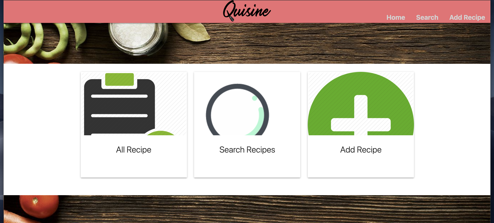
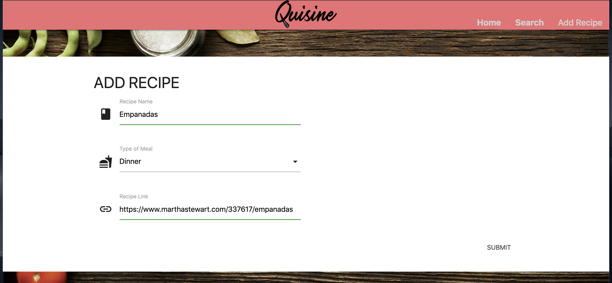
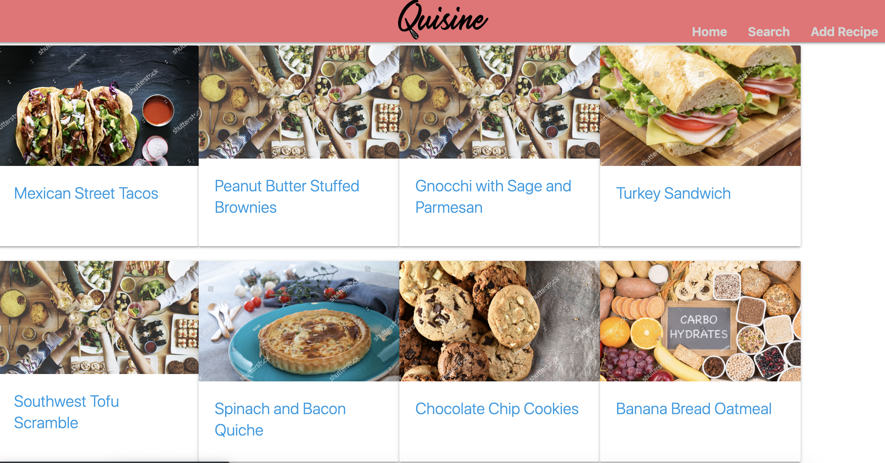

# Quisine

This is a web application that allows you to store recipes in one convenient place. Quisine is deployed on heroku at [Heroku Link](https://sheltered-woodland-39608.herokuapp.com/)

### About

#### Adding a Recipe
To add recipes to your page, simply click on the `Add Recipe` button. Input the recipe name, website for the recipe, and select type of recipe from the drop-down. Recipe types include breakfast, lunch, dinner, and dessert. Once all these fields are filled out, click the submit button. The app will let you know if you've successfully added a recipe by displaying `Recipe Added!` to the screen.  

#### Viewing All Recipes
To view all the recipes you've collected on your app, click on the `All Recipes` icon. This will display clickable cards with the name and image of each recipe. When you find a recipe you like, click on the recipe card and a modal will pop up. From here you can rate the recipe, favorite the recipe, view the recipe, write a comment on the recipe, and delete the recipe.  

#### Search for a Recipe
Quisine also has a search feature. Look up a recipe by its name, type of meal, or rating. The results will display all appropriate recipes cards.  

### Languages and Tools Used
* HTML
* CSS
* Javascript
* Heroku
* Node.js
* Express
